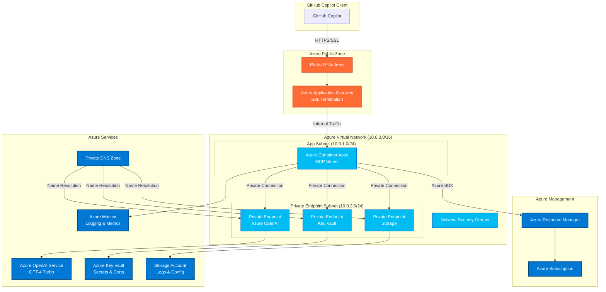

# Azure Deployment Architecture

## High-Level Architecture Diagram

## Network Flow

1. **Client Connection**: GitHub Copilot connects via HTTPS to the public IP address
2. **SSL Termination**: Application Gateway terminates SSL and forwards to container apps
3. **Private Communication**: All internal Azure service communication uses private endpoints
4. **Azure SDK Integration**: MCP server uses Azure Management SDK to query resources
5. **AI Processing**: Requests are processed using Azure OpenAI via private endpoint

## Security Layers

- **External**: Public IP with Application Gateway WAF protection
- **Network**: VNet isolation with Network Security Groups
- **Transport**: SSL/TLS encryption for all external communication
- **Application**: Managed Identity for service-to-service authentication
- **Data**: Private endpoints for all Azure services, Key Vault for secrets

## Cost Optimization Features

- **Auto-scaling**: Container apps scale based on demand (1-5 instances)
- **Regional Deployment**: Single region deployment to minimize data transfer costs
- **Reserved Instances**: Application Gateway with reserved capacity
- **Monitoring**: Proactive monitoring to prevent cost overruns